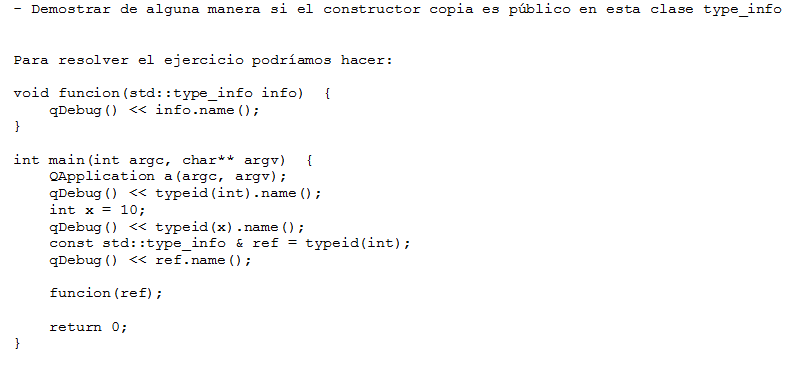
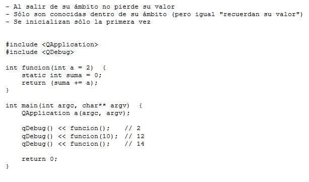
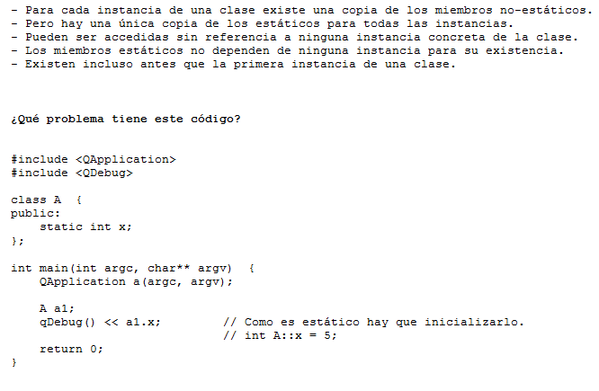
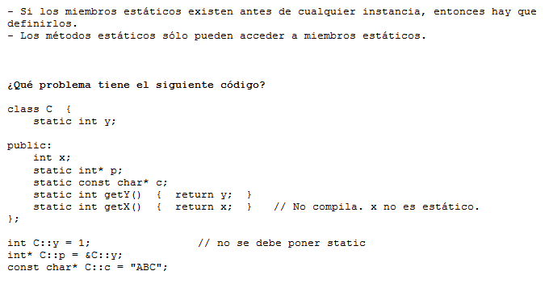
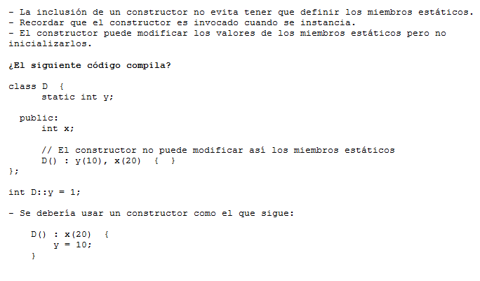
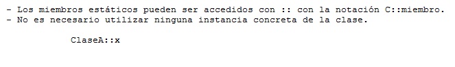
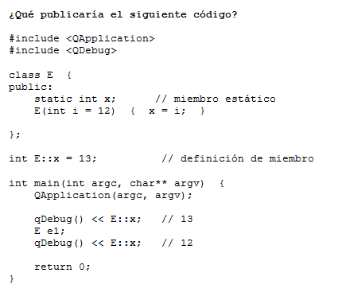

.. -*- coding: utf-8 -*-

.. _rcs_subversion:

Clase 09 - PGE 2015
===================

**typeid**

.. figure:: images/clase09/typeid.png

**Clase type_info**

.. figure:: images/clase09/type_info.png

**Ejercicio 1**

**Ejercicio 2**

.. figure:: images/clase09/ejercicio2.png

**Variables estáticas**

**Miembros estáticos**

.. figure:: images/clase09/miembros_estaticos2.png

.. figure:: images/clase09/miembros_estaticos3.png

**El constructor y miembros estáticos**

**Particularidades de la notación**

**Ejercicio 3**

.. figure:: images/clase09/ejercicio3.png

