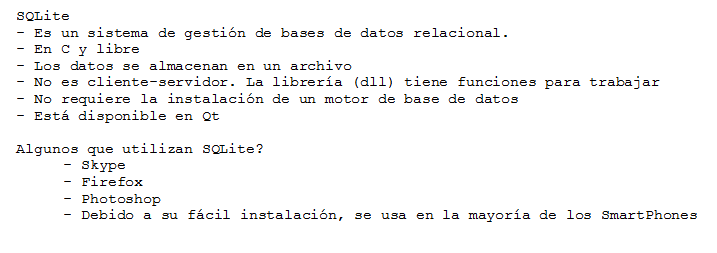

.. -*- coding: utf-8 -*-

.. _rcs_subversion:

Clase 09 - PGE 2015
===================

**typeid**

.. figure:: images/clase09/typeid.png

**Clase type_info**

	- Dispone de un método para pregunta si es puntero y otro para puntero a función:
		    
		virtual bool __is_pointer_p() const;
    
		virtual bool __is_function_p() const;

.. figure:: images/clase09/type_info.png

**Ejercicio 1**

.. figure:: images/clase09/ejercicio1.png

**Ejercicio 2**

.. figure:: images/clase09/ejercicio2.png

Variables estáticas
===================

**Miembros estáticos**

.. figure:: images/clase09/miembros_estaticos1.png

.. figure:: images/clase09/miembros_estaticos2.png

.. figure:: images/clase09/miembros_estaticos3.png

.. figure:: images/clase09/miembros_estaticos4.png

**El constructor y miembros estáticos**

**Particularidades de la notación**

.. figure:: images/clase09/notacion.png

**Ejercicio 3**

.. figure:: images/clase09/ejercicio3.png

Base de datos con SQLite
========================

.. figure:: images/clase09/sqlite2.png

.. figure:: images/clase09/sqlite3.png

**Ejercicio 4**

.. figure:: images/clase09/ejercicio4.png

.. figure:: images/clase09/ejercicio4a.png

.. figure:: images/clase09/ejercicio4b.png

**Para independizar del SO**

.. figure:: images/clase09/independizar.png

**Consulta a la base de datos**

.. figure:: images/clase09/consultar2.png

