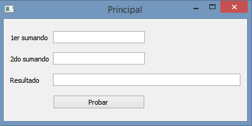

.. -*- coding: utf-8 -*-

.. _rcs_subversion:

Clase 12 - PGE 2015
===================

Ejemplos de ejercicios del primer parcial
^^^^^^^^^^^^^^^^^^^^^^^^^^^^^^^^^^^^^^^^^

**Ejercicio 1:**

- Se adjunta el código fuente para que sea compilado en una librería estática.
- Separar en distintas carpetas los archivos de cabecera y la librería estática (por ejemplo, en las carpetas 'includes' y 'libs'

.. figure:: images/clase06/primer_parcial_1_proteus.png
   :target: resources/clase06/parcial_1_v1.rar

:Código fuente para compilar (descargar desde View Raw): sources/clase12/LineaDeTextoLib.rar

**Ejercicio 2:**

- En un proyecto nuevo, utilizar la librería generada en el ejercicio 1 para crear la siguiente GUI:

