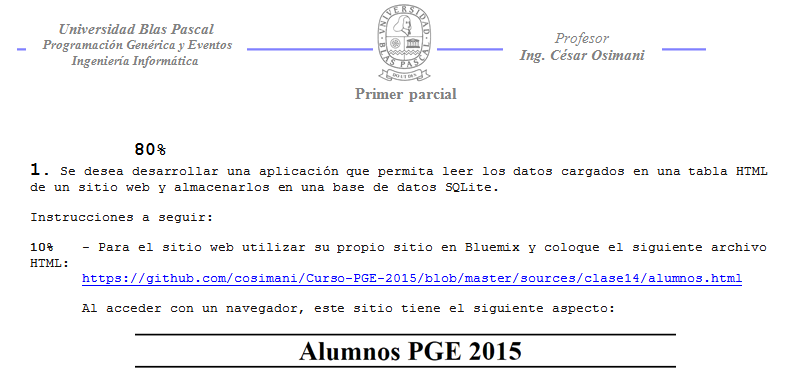
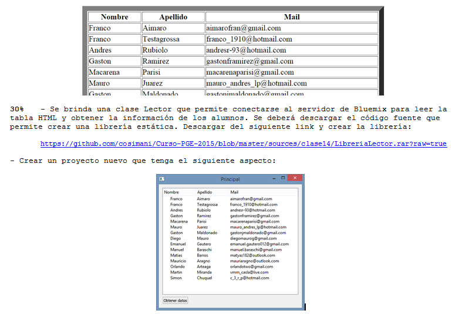
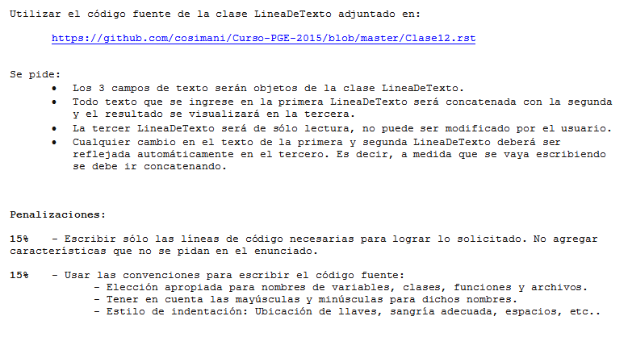

.. -*- coding: utf-8 -*-

.. _rcs_subversion:

Clase 14 - PGE 2015
===================

Primer Parcial
^^^^^^^^^^^^^^

**Enunciado de los 2 ejercicios**

.. figure:: images/clase14/03.png

**Resolución**

* Ejercicio 1 <https://github.com/cosimani/Curso-PGE-2015/blob/master/sources/clase14/Ejercicio1.rar?raw=true>

* Ejercicio 2 <https://github.com/cosimani/Curso-PGE-2015/blob/master/sources/clase14/Ejercicio2.rar?raw=true>

